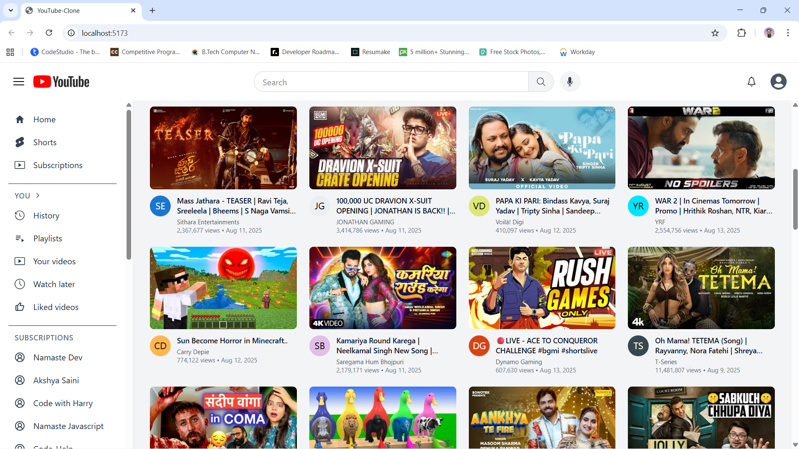

# 🎥 YouTube Clone

A **feature-rich, responsive YouTube clone** built with **React 18**, **Redux Toolkit**, and **Tailwind CSS**, integrating the **YouTube Data API v3** for real video content. Includes advanced features like **real-time chat simulation**, **nested threaded comments**, and **search suggestions with caching**.

---

## ✨ Core Features

- 🎬 **Video Playback** – Embedded YouTube player with dynamic routing.  
- 💬 **Live Chat Simulation** – Auto-scrolling chat with random user/message generation.  
- 🗨 **Threaded Comments** – Infinite-level nested comment structure.  
- 🔍 **Instant Search Suggestions** – YouTube API-powered autocomplete with result caching.  
- 📱 **Fully Responsive UI** – Optimized for mobile, tablet, and desktop.  
- ⚡ **Global State Management** – Redux Toolkit slices for menu, search, and chat.  

---

## 📂 Directory Structure

```plaintext
src/
├── 📁 components/      # UI Components
├── 📁 utils/           # Redux slices, constants, helpers
├── ⚛ App.jsx           # Main app component
└── 🚀 index.jsx        # App entry point

🚀 Installation & Setup
1️⃣ Clone the repository
git clone https://github.com/your-username/your-repo.git

2️⃣ Navigate to the project folder
cd your-repo

3️⃣ Install dependencies
npm install

4️⃣ Create environment file
touch .env


Add your YouTube API key to .env:
VITE_GOOGLE_API_KEY=your_youtube_api_key

5️⃣ Start the development server
npm run dev


🔑 Environment Variables
Variable	Description
VITE_GOOGLE_API_KEY	YouTube Data API v3 key for fetching videos & suggestions

🧩 Tech Stack
• Frontend: React 18

• State Management: Redux Toolkit

• Styling: Tailwind CSS

• API: YouTube Data API v3

• Icons: React Icons

## 🎥 Demo Video

<p align="center">
  <a href="https://drive.google.com/file/d/1aFTUeX_3YndsfGrqPOw-MKeLkERVRJzl/view?usp=sharing" target="_blank">
    
  </a>
</p>


🤝 Contribution Guidelines
1. Fork the repository

2. Create a new branch (feature/your-feature-name)

3. Commit changes (git commit -m 'Add some feature')

4. Push to branch (git push origin feature/your-feature-name)

5. Open a Pull Request

📜 License
This project is licensed under the MIT License – see the LICENSE file for details.


---

### ✅ Improvements Made:
- Headings now use proper `#` markdown (so GitHub renders them bigger & bolder).
- Directory tree inside **fenced code block** → perfect alignment.
- **Environment variables** are in a clean table format.
- Added section dividers `---` for clear separation.
- Demo video link now stays centered with a clean thumbnail style.
- Kept all your emojis, but now inside structured headings for readability.

If you use **this exact README.md** in your repo, it will look professional and perfectly aligned on GitHub.  

Do you also want me to **create a modern, clean `assets/demo-thumbnail.png`** so your Google Drive video link has a professional clickable preview instead of the broken image? That would make it look even better.
