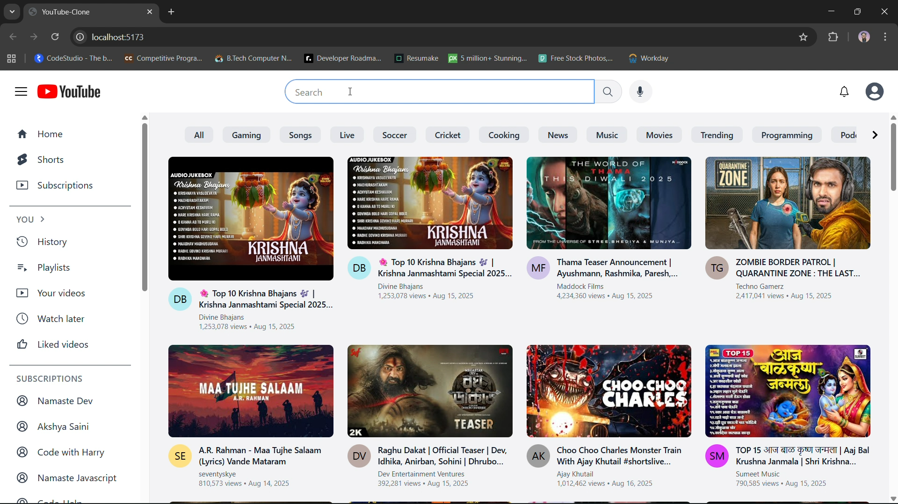

# 🎥 YouTube Clone — React + Redux Toolkit + Tailwind CSS 🚀


[](https://drive.google.com/file/d/16toRiga47LpVGagjHQP2Ooo7cqTCSzdj/view?usp=sharing)

A fully responsive, **React **-powered YouTube clone built with **Redux Toolkit** and **Tailwind CSS**, using the **YouTube Data API v3** for real-time content.  
Includes advanced features like **live chat simulation**, **nested comments**, and **search suggestions with caching**.

---

## ✨ Features

- **🎬 Video Playback**
  - Embedded YouTube player with dynamic routing
- **💬 Live Chat Simulation**
  - Auto-scrolling chat with random user/message generation
- **🗨 Threaded Comments**
  - Infinite-level nested comment structure
- **🔍 Instant Search Suggestions**
  - YouTube API-powered autocomplete with result caching
- **📱 Fully Responsive**
  - Optimized for mobile, tablet, and desktop
- **⚡ State Management**
  - Redux Toolkit slices for menu, search, and chat

---

## 📦 Tech Stack

- ⚛️ **React**
- 🛠 **Redux Toolkit**
- 🎨 **Tailwind CSS**
- 🌐 **YouTube Data API v3**
- 🔧 **React Icons**

---

## 📂 Project Structure

```plaintext
YOUTUBE-CLONE/
├── src/
│   ├── components/        # UI Components
│   │   ├── Body.jsx
│   │   ├── Button.jsx
│   │   ├── ButtonList.jsx
│   │   ├── MainContainer.jsx
│   │   ├── SideBar.jsx
│   │   ├── VideoContainer.jsx
│   ├── utils/             # Redux slices, constants, helpers
│   ├── App.jsx            # Main app component
│   ├── index.jsx          # App entry point
├── public/
├── package.json
├── README.md
└── .env


🔑 Environment Variables
Variable	         Description
VITE_GOOGLE_API_KEY	YouTube Data API v3 key for fetching videos & suggestions


🚀 Getting Started
# Clone the repository
git clone https://github.com/achalkumar98/youtube-clone.git

# Navigate to the project folder
cd your-repo

# Install dependencies
npm install

# Create environment file and add your API key
echo "VITE_GOOGLE_API_KEY=your_youtube_api_key" > .env

# Run the development server
npm run dev


🤝 Contribution Guidelines

1. Fork the repository

2. Create a new branch (feature/your-feature-name)

3. Commit changes (git commit -m 'Add some feature')

4. Push to branch (git push origin feature/your-feature-name)

5. Open a Pull Request


📜 License
This project is licensed under the MIT License – see the LICENSE file for details.


---

### Why this works better on GitHub:
- The badges load instantly and give it a professional look.
- The clickable demo thumbnail works without `<p>` tags (avoids HTML rendering issues).
- The file structure is inside a fenced code block so alignment stays perfect.
- Emojis are used sparingly but make it engaging.

---

If you want, I can also **add the `LICENSE` file** so the MIT badge works and GitHub auto-detects the license.  
Do you want me to include that next?
